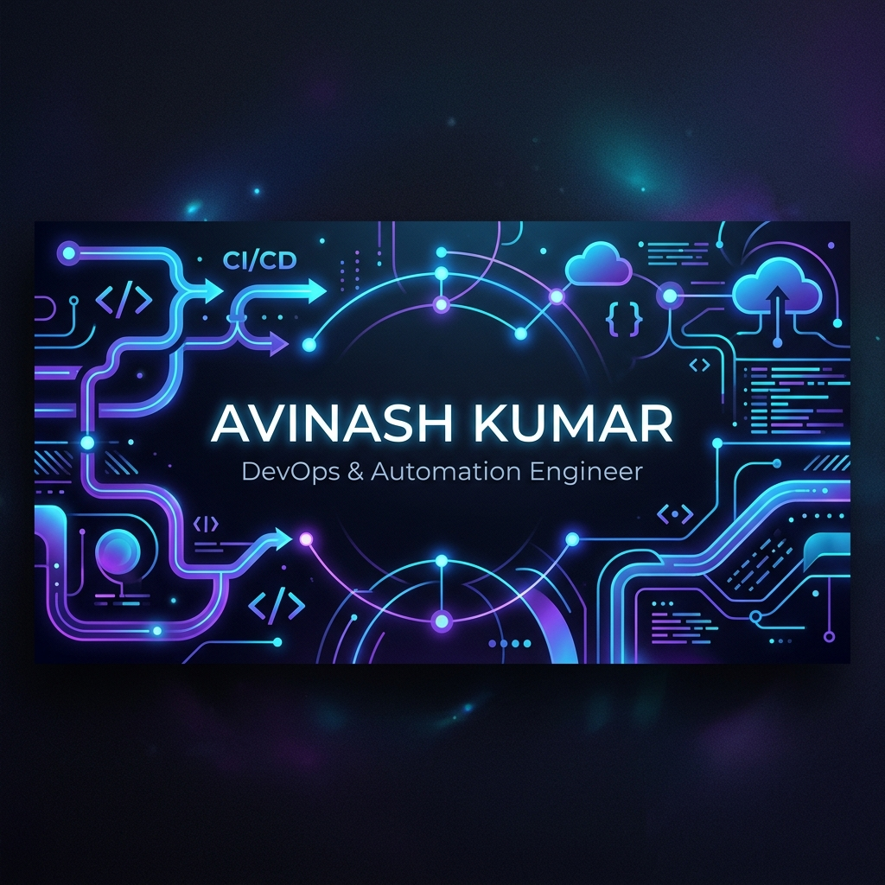
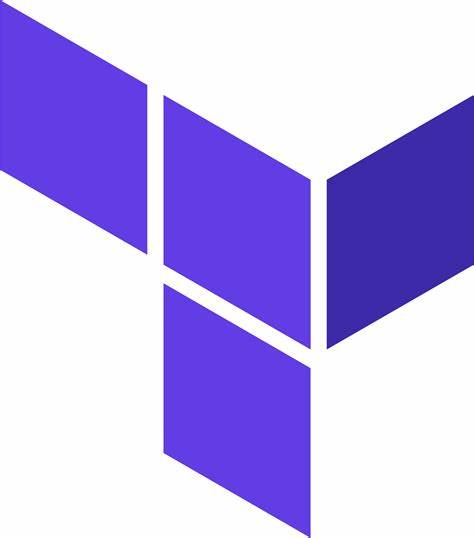
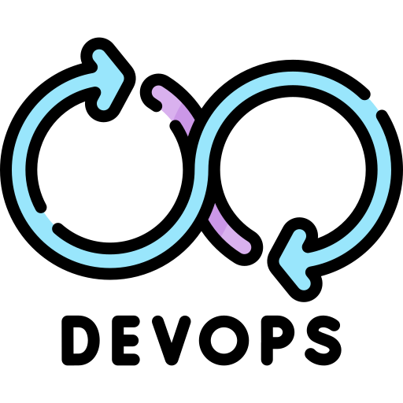
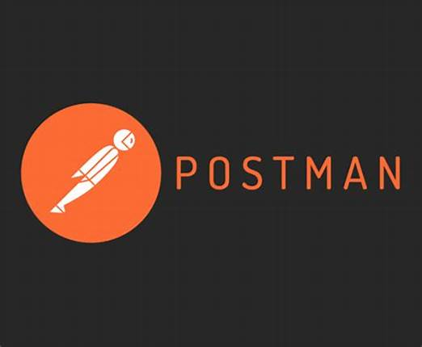

  

<h1 align="center">Hi there! I'm Avinash Kumar 👋</h1>

  <b>DevOps & Automation Engineer | Cloud Enthusiast</b>

  
  &nbsp;&nbsp;
  

---

### 🚀 About Me

<table width="100%">
  <tr>
    <td width="55%" valign="top">
      
I am a passionate <b>DevOps & Automation Engineer</b> with over 4.6 years of experience in the IT industry. I specialize in cloud infrastructure orchestration, automation pipelines, and software release enhancement.

      <ul>
        <li>💼 <b>4 Years & 10 Months of Experience</b> as a DevOps, Automation, Support, and Enhancement Engineer.</li>
        <li>☁️ <b>Microsoft Certified Azure Fundamentals</b> with hands-on expertise in Microsoft Azure, Azure DevOps, CI/CD pipelines, and Infrastructure as Code (IaC) using Terraform.</li>
        <li>⚙️ <b>Automation Advocate</b> using PowerShell, Bash, and Go to streamline operations and enhance system availability.</li>
        <li>🔄 <b>End-to-End Delivery</b> across all project phases: gathering requirements, coding, automated testing, performance tuning, and implementation.</li>
        <li>🛠️ Experienced in delivering robust, high-performance solutions in fast-paced, challenging environments.</li>
      </ul>
    </td>
    <td width="45%" valign="top" align="center">
       
      
    </td>
  </tr>
</table>

---

### ⚡ Technologies & Tools

<table width="100%">
  <tr>
    <td width="33%" valign="top">
      <h4>☁️ Cloud & DevOps</h4>
      <table>
        <tr>
          <td></td>
          <td><b>Azure DevOps</b></td>
        </tr>
        <tr>
          <td></td>
          <td><b>Azure Pipelines</b></td>
        </tr>
        <tr>
          <td></td>
          <td><b>Terraform (IaC)</b></td>
        </tr>
        <tr>
          <td></td>
          <td><b>DevOps</b></td>
        </tr>
      </table>
    </td>
    <td width="33%" valign="top">
      <h4>💻 Languages & Scripting</h4>
      <table>
        <tr>
          <td></td>
          <td><b>Go (Golang)</b></td>
        </tr>
        <tr>
          <td></td>
          <td><b>PowerShell</b></td>
        </tr>
        <tr>
          <td></td>
          <td><b>Shell Scripting</b></td>
        </tr>
        <tr>
          <td></td>
          <td><b>YAML Config</b></td>
        </tr>
        <tr>
          <td></td>
          <td><b>SQL Databases</b></td>
        </tr>
      </table>
    </td>
    <td width="33%" valign="top">
      <h4>🛠️ Dev Tools</h4>
      <table>
        <tr>
          <td></td>
          <td><b>VS Code</b></td>
        </tr>
        <tr>
          <td></td>
          <td><b>Git Bash</b></td>
        </tr>
        <tr>
          <td></td>
          <td><b>Postman</b></td>
        </tr>
      </table>
    </td>
  </tr>
</table>

---

### 🎨 Contribution Graph

  

